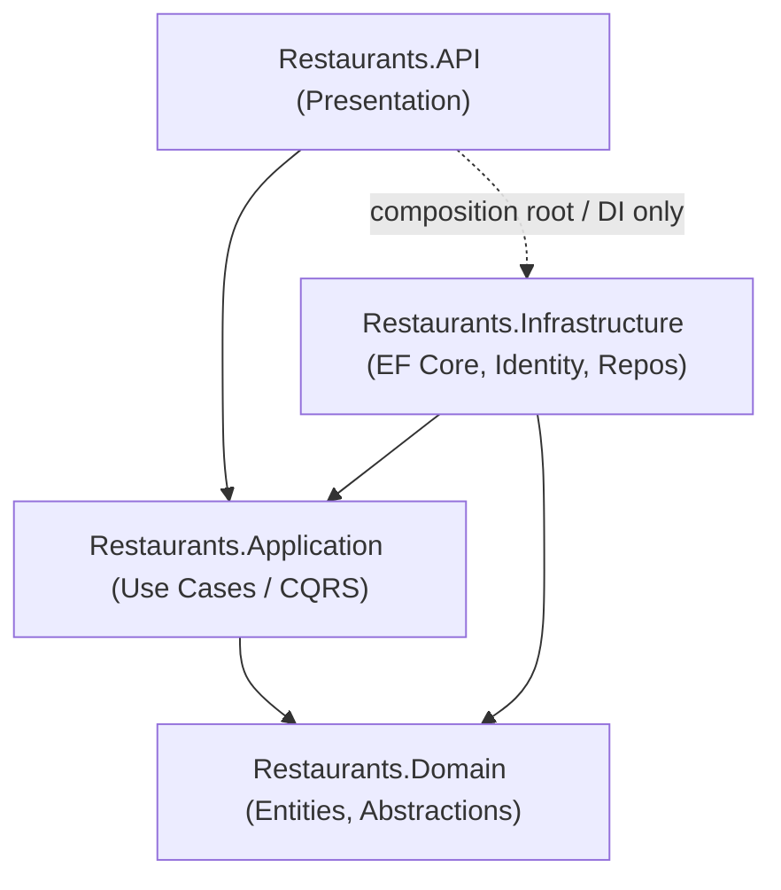
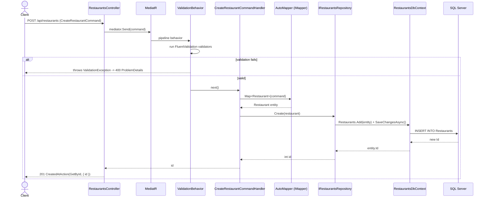

# Restaurants API — Architecture & Onboarding Guide

Welcome to the **Restaurants** management REST API. This document is the primary
onboarding reference for new backend developers. All content is derived from the
current source in this workspace.

---

## 1. Overview

The Restaurants API is an ASP.NET Core REST service for managing **Restaurants**
(and their **Dishes**) with **user identity**.

High-level capabilities:

- **Restaurants management** — create, read (all / by id), update (PATCH), delete.
  See `Restaurants.API/Controllers/RestaurantsController.cs`.
- **Dishes** — a restaurant owns a collection of `Dish` entities
  (`Restaurants.Domain/Entities`, mapped via EF Core in `RestaurantsDbContext`).
- **Identity** — user registration, login, password reset, etc. exposed via the
  built-in ASP.NET Core Identity minimal API at `api/identity`
  (`MapIdentityApi<ApplicationUser>()`).
- **Role-based authorization** — e.g. creating a restaurant requires the
  `Owner` role (`[Authorize(Roles = UserRoles.Owner)]`).

Target frameworks: **.NET 8 / .NET 9**.

Stack: ASP.NET Core, EF Core (SQL Server), MediatR, AutoMapper, FluentValidation,
ASP.NET Core Identity (JWT Bearer), Serilog, Swagger.

---

## 2. Solution Structure

Clean Architecture across four projects:

| Project | Responsibility | Key namespaces / folders | Key dependencies |
| --- | --- | --- | --- |
| `Restaurants.API` | Presentation: controllers, middleware, filters, Swagger, JWT auth, DI composition | `Controllers`, `Middlewares` (`RequestTimeLoggingMiddleware`), `Exceptions` (`GlobalExceptionHandler`), `Filters`, `Extensions` (`WebApplicationExtensions`, `DependencyInjection`) | `Restaurants.Application`, `Restaurants.Infrastructure`, ASP.NET Core, Serilog, Swashbuckle, JwtBearer |
| `Restaurants.Application` | Use cases: CQRS via MediatR, DTOs, validators, mapping, cross-cutting behaviors | `Restaurants.Commands.*`, `Restaurants.Queries.*`, `Restaurants.Dtos`, `Behavior` (`ValidationBehavior`), `Abstractions.Repositories`, `Abstractions.User`, `User` | `Restaurants.Domain`, MediatR, AutoMapper, FluentValidation |
| `Restaurants.Infrastructure` | EF Core (SQL Server), Identity, repositories, seeder, authorization | `Persistence` (`RestaurantsDbContext`), `Repositories`, `Identity`, `Seeders`, `Authorization` | `Restaurants.Application`, `Restaurants.Domain`, EF Core, ASP.NET Core Identity |
| `Restaurants.Domain` | Entities & domain abstractions/exceptions | `Entities` (`Restaurant`, `Dish`, `Address`), `Constants` (`UserRoles`), `Exceptions` (`NotFoundException`, `ValidationException`) | None (innermost layer) |

---

## 3. Architecture Diagram

Dependencies point **inward** toward the Domain.



> Note: `Restaurants.API` references `Restaurants.Infrastructure` only at the
> **composition root** (`AddInfrastructureLayer`) to wire up DI; application code
> depends on abstractions defined in `Restaurants.Application.Abstractions`.

---

## 4. Request Lifecycle — `POST /api/restaurants`

Endpoint: `RestaurantsController.CreateRestaurant`
(`[Authorize(Roles = UserRoles.Owner)]`).



---

## 5. Cross-Cutting Concerns

### Logging
- **Serilog** is configured via `builder.Host.UseSerilog(...)` reading from
  configuration (`WebApplicationExtensions.ConfigureServices`).
- `app.UseSerilogRequestLogging()` logs each HTTP request.
- `RequestTimeLoggingMiddleware` (`IMiddleware`, registered scoped) measures
  request duration and logs when a request takes **> 4 seconds**.

### Validation pipeline
- FluentValidation validators are auto-registered from the Application assembly
  (`AddValidatorsFromAssembly`).
- A generic MediatR pipeline behavior, `ValidationBehavior<TRequest, TResponse>`,
  runs all validators; on failure it throws `Domain.Exceptions.ValidationException`
  containing a `PropertyName -> messages` dictionary.
- The `[ApiController]` automatic model-state validation is **disabled**
  (`SuppressModelStateInvalidFilter = true`) so validation flows through the pipeline.

### Global exception handling
- `GlobalExceptionHandler : IExceptionHandler` is registered via
  `AddExceptionHandler<GlobalExceptionHandler>()` + `AddProblemDetails()`, and
  activated by `app.UseExceptionHandler()`.
- Mappings:

  | Exception | Status | Response |
  | --- | --- | --- |
  | `NotFoundException` | 404 | `ProblemDetails` with `resourceType`/`resourceId` extensions |
  | `ValidationException` | 400 | `ValidationProblemDetails` with per-field errors |
  | (default) | 500 | Generic `ProblemDetails`, exception logged |

- In Development, `UseDeveloperExceptionPage()` is also enabled.

### Authentication / Authorization
- ASP.NET Core **Identity** with `ApplicationUser` and `IdentityRole`, backed by
  `RestaurantsDbContext` (`AddIdentityApiEndpoints` + `AddEntityFrameworkStores`).
- Custom claims via `RestaurantsUserClaimsPrincipalFactory`.
- **JWT Bearer** authentication (`AddAuthentication`, `AddJwtBearer` referenced in
  `Restaurants.API/Extensions/DependencyInjection.cs`).
  > TODO: confirm the JWT `AddJwtBearer(...)` options and signing key source.
- `app.UseAuthentication()` / `app.UseAuthorization()` in the pipeline.
- Controllers are `[Authorize]` by default; `GetAll` is `[AllowAnonymous]`;
  `CreateRestaurant` requires role `UserRoles.Owner`.

---

## 6. Dependency Injection Map

Composition root: `Program.cs` → `builder.ConfigureServices().ConfigurePipeline()`
(`Restaurants.API/Extensions/WebApplicationExtensions.cs`). Layers registered in
order: `AddPresentationLayer()` → `AddApplicationLayer()` → `AddInfrastructureLayer(configuration)`.

### `AddPresentationLayer()` — `Restaurants.API/Extensions/DependencyInjection.cs`
- `AddAuthentication()`
- `AddControllers()` with `SuppressModelStateInvalidFilter = true`
- Swagger (`AddSwaggerGen`) with a `bearerAuth` (JWT) security scheme + requirement
- `AddEndpointsApiExplorer()` (to surface the Identity minimal API)
- `AddProblemDetails()` + `AddExceptionHandler<GlobalExceptionHandler>()`
- `AddScoped<RequestTimeLoggingMiddleware>()`

### `AddApplicationLayer()` — `Restaurants.Application/DependencyInjection.cs`
- MediatR (`RegisterServicesFromAssemblies`)
- AutoMapper (Application assembly profiles)
- FluentValidation validators (Application assembly)
- `IPipelineBehavior<,>` → `ValidationBehavior<,>` (transient)
- `IUserContext` → `UserContext` (scoped)

### `AddInfrastructureLayer(configuration)` — `Restaurants.Infrastructure/DependencyInjection.cs`
- `AddRestaurantsDbContext` → `RestaurantsDbContext` on SQL Server
  (connection string `RestaurantsDb`, `EnableSensitiveDataLogging()`)
- `AddIdentityLayer` → Identity API endpoints, roles, claims factory, EF stores;
  scoped `IApplicationUser`, `IApplicationUserStore`, `IApplicationUserManager`,
  `IApplicationRoleManager`
- `AddRepositories` → `IRestaurantsRepository`→`RestaurantsRepository`,
  `IDishesRepository`→`DishesRepository`
- `AddSeedData` → `IRestaurantSeeder` → `RestaurantSeeder`
- `AddHttpContextAccessor()`

Database seeding runs at startup in `ConfigurePipeline()` inside a temporary DI
scope: `seeder.Seed()`.

---

## 7. Configuration & Secrets

- `Restaurants.API/appsettings.json` — base logging levels and `AllowedHosts`.
- `Restaurants.API/appsettings.Development.json` — contains:
  - **Connection string** `RestaurantsDb` (LocalDB by default):

    ```json
    "ConnectionStrings": {
      "RestaurantsDb": "Server=(localdb)\\mssqllocaldb;Database=RestaurantsDb;Trusted_connection=True;"
    }
    ```

  - **Serilog** sinks: Console (custom output template) and rolling File
    (`Logs/Restaurants-API-.log`, daily, compact JSON formatter).

### Where secrets should live
- The connection string is resolved via `configuration.GetConnectionString("RestaurantsDb")`.
- For local dev, prefer **User Secrets** (`dotnet user-secrets`) over committing
  values; for other environments use **environment variables**
  (e.g. `ConnectionStrings__RestaurantsDb`) or a secret store.
  > TODO: confirm — no `appsettings.Production.json` or JWT key configuration was
  > observed; the JWT signing key source should be moved to user-secrets/env.

---

## 8. Getting Started

```bash
# 1. Clone
git clone https://github.com/kon-amp/Restaurants.git
cd Restaurants

# 2. Restore
dotnet restore Restaurants.sln

# 3. Set the connection string (recommended: user-secrets on the API project)
dotnet user-secrets --project Restaurants.API set "ConnectionStrings:RestaurantsDb" "Server=(localdb)\mssqllocaldb;Database=RestaurantsDb;Trusted_Connection=True;"

# 4. Apply EF Core migrations (DbContext lives in Restaurants.Infrastructure)
dotnet ef database update --project Restaurants.Infrastructure --startup-project Restaurants.API

# 5. Run
dotnet run --project Restaurants.API
```

Then:
- Open **Swagger UI** at `/swagger` (enabled in the Development environment).
- **Authenticate** using the Identity endpoints under `api/identity`
  (register, then login to obtain a token), and use the **Bearer** token in Swagger's
  Authorize dialog for secured endpoints.
- Startup automatically runs `RestaurantSeeder.Seed()` to seed initial data.

> TODO: confirm — no migrations were reviewed; if the `Migrations` folder is empty,
> create the initial migration with
> `dotnet ef migrations add Init --project Restaurants.Infrastructure --startup-project Restaurants.API`.

---

## 9. Conventions

### CQRS folder structure
Use cases live under `Restaurants.Application/Restaurants/` split into
`Commands/<UseCase>/` and `Queries/<UseCase>/`, each folder containing:
- the request (`...Command` / `...Query` implementing `IRequest<T>`),
- its `...Handler` (`IRequestHandler<TRequest, TResponse>`),
- a `Validators/` subfolder for the FluentValidation validator (commands).

Example (`Commands/CreateRestaurant/`):

```csharp
public class CreateRestaurantCommand : IRequest<int> {
    public string Name { get; set; } = default!;
    public string Description { get; set; } = default!;
    public string Category { get; set; } = default!;
    public bool HasDelivery { get; set; }
    public string? ContactEmail { get; set; }
    public string? ContactNumber { get; set; }
    public string? City { get; set; }
    public string? Street { get; set; }
    public string? PostalCode { get; set; }
}
```

### DTO usage
- Read models are returned as DTOs from `Restaurants.Application/Restaurants/Dtos`
  (e.g. `RestaurantDto`), never exposing domain entities directly.
- AutoMapper handles `Command`/`Entity`/`Dto` mapping (profiles auto-scanned from
  the Application assembly).

### Validators
- One `AbstractValidator<TCommand>` per command (auto-registered), executed by the
  MediatR `ValidationBehavior` before the handler runs.
- Example rules from `CreateRestaurantCommandValidator`: `Name` length 3–100,
  required `Description`/`Category`, `Category` must be one of a fixed allow-list,
  valid email/phone, and postal code pattern `^\d{2}-\d{3}$`.

### Controllers
- Thin controllers delegate to MediatR (`mediator.Send(...)`); no business logic.
- Secured by default (`[Authorize]`); opt out per-action with `[AllowAnonymous]`
  or tighten with `[Authorize(Roles = ...)]`.
  
